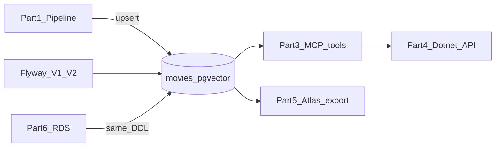

# Part 2 — Vector Database (pgvector)

Part 2 is the shared contract between the pipeline, the MCP server, the .NET API, Atlas, and Terraform. Implement the **schema, migrations, indexes, and a documented hybrid query** now; leave row loading to [pipeline/src/pipeline/loader.py](../../pipeline/src/pipeline/loader.py) (Part 1.5).

## What changed in Section 1 (re-checked)

**1.1 Data Cleaning is complete** (all five brief bullets). The other agent landed this while the first Part 2 draft assumed only Point 1 existed.

- [pipeline/src/pipeline/cleaning.py](../../pipeline/src/pipeline/cleaning.py) runs rename → strings → dates → duplicates → numerics.
- Columns are already **schema snake_case** (`title`, `release_date`, `release_year`, `major_genre`, `rt_rating`, `imdb_votes`, …). Rename map accepts both spaced brief names and underscored `vega-datasets` names.
- Dedup key is now **`(normalized title, release_year)`**, not the interim raw date string. [reports/section-1.md](../../reports/section-1.md) states the loader/DB unique index **`(lower(title), release_year)` is the only key that matters**.
- Real-dataset facts: 3,201 in → 3,201 out; **0** true dupes; **22** century corrections (years > 2011 → −100, range 1915–2011); **1 untitled row** (2006-11-03) kept as `rows_missing_dedup_key`; 9 numeric titles stringified; 66/47 zero grosses nulled.
- Pipeline is run with `docker compose run --rm --no-deps pipeline` until 1.4/1.5. Compose `depends_on` for postgres/migrate/embeddings is unchanged and should stay for the full platform.
- **1.2–1.5 are still stubs** (`imputation.py`, `augmentation.py`, `embedding.py`, `loader.py`).
- Unrelated tooling: root [pyproject.toml](../../pyproject.toml) uv workspace + `uv.lock` + `.python-version`. Does not change the schema.

**Implication for this plan:** drop the extra `natural_key` column. Align uniqueness with the 1.1 contract instead of inventing a second key.

## Current DB state

Scaffold already exists and should be **evolved, not replaced**:

- Flyway wired in [docker-compose.yml](../../docker-compose.yml) (`migrate` job; `pipeline` already waits on it).
- Example schema in [database/migrations/V1__initial_schema.sql](../../database/migrations/V1__initial_schema.sql) + indexes in [database/migrations/V2__indexes.sql](../../database/migrations/V2__indexes.sql).
- Existing unique index `UNIQUE (lower(title), release_year)` now **matches 1.1**, with one known hole: Postgres unique indexes do not collide on NULL, so the untitled 2006 row cannot use `ON CONFLICT` as-is.

Until any environment is shared, keep changing `V1`/`V2` in place and document `docker compose down -v` after schema edits.

## Constraints from Part 1 (now measured, not guessed)

- **Unique key contract:** `ON CONFLICT (lower(title), release_year)`. Remakes survive (*The Mummy* 1999 vs 2002).
- **Untitled row:** keep `title` **nullable** (do not use `title TEXT NOT NULL` from the example). 1.5 must still decide drop vs synthetic title (e.g. `"(untitled)"`) if that one row should be idempotent; schema must not reject it.
- **Unparseable dates:** 0 on the live file; rows with NULL year are still kept by cleaning. Unique index should be **partial** `WHERE title IS NOT NULL AND release_year IS NOT NULL` so dated, titled movies are unique, and the 1.5 edge case is explicit.
- **Embedding contract (unchanged):** `nomic-embed-text` / **768-dim**, cosine; stored docs prefixed `search_document:` (query prefix is MCP, not schema).
- **Columns already produced by 1.1:** `title`, `release_date`, `release_year`, `major_genre`, `mpaa_rating`, `director`, `distributor`, `creative_type`, `source`, `imdb_rating`, `imdb_votes`, `rt_rating`, `production_budget`, `us_gross`, `worldwide_gross`, `running_time_min`. Persist all of these except `us_dvd_sales` (cleaned, but still too sparse for search; omit from the table).
- **Still planned, not yet in the frame:** 1.2 `*_imputed` flags; 1.3 `budget_tier`, `decade`, `rating_score_delta`, `blockbuster_flag`, `augmented_text`. Put them in V1 now so 1.2–1.5 can fill them without another migration.

## Constraints from later parts



- **Part 3 filters** on `major_genre`, `imdb_rating`, `mpaa_rating`, `decade`; `get_movie_by_title` needs exact + **trigram** fuzzy match; `get_similar_movies` is kNN by `id` excluding self; `list_genres` / `get_dataset_stats` are aggregates. Example NL queries also need **director, distributor, budget_tier, rt_rating, creative_type** stored (semantic match via `augmented_text`; columns still required for results/Atlas).
- **Part 4** is a pass-through of those tools; UUID `id` is the public movie identity.
- **Part 5** exports `id`, `title`, `major_genre`, `embedding` (+ extra metadata).
- **Part 6:** same SQL on RDS; `CREATE EXTENSION vector` must remain valid for `rds_superuser` later. **Fix now:** [mcp-server](../../docker-compose.yml) (and Atlas) currently depend only on `postgres` healthy — they must also wait on `migrate` completing. Do **not** change the 1.1 `--no-deps` pipeline invocation.

## Schema design (extend V1)

Keep Flyway (already in Compose). **Justification to document:** polyglot stack (Python + .NET), SQL-first pgvector DDL, same files runnable on local Postgres and RDS; Alembic would tie migrations to the Python service.

Replace the example table with this shape (names match 1.1 output and MCP `MovieResult`):

- **Identity:** `id UUID PRIMARY KEY`. Unique index `ON movies (lower(title), release_year) WHERE title IS NOT NULL AND release_year IS NOT NULL` — this is the 1.1 / 1.5 conflict target. No separate `natural_key` column.
- **Core metadata:** `title TEXT` (nullable), `release_date DATE`, `release_year INTEGER`, `major_genre`, `mpaa_rating`, `director`, `distributor`, `creative_type`, `source`.
- **Numerics:** `imdb_rating NUMERIC(3,1)`, `imdb_votes INTEGER`, `rt_rating INTEGER`, `production_budget BIGINT`, `us_gross` / `worldwide_gross BIGINT`, `running_time_min INTEGER`.
- **Derived (Part 1.3, empty until then):** `budget_tier TEXT`, `decade INTEGER`, `rating_score_delta NUMERIC`, `blockbuster_flag BOOLEAN`.
- **Provenance (Part 1.2, empty until then):** `imdb_rating_imputed`, `rt_rating_imputed`, `production_budget_imputed`, `running_time_min_imputed` (all `BOOLEAN NOT NULL DEFAULT FALSE`).
- **Search payload:** `augmented_text TEXT`, `embedding vector(768)` (nullable until the loader exists; HNSW will be partial).
- **Audit:** `pipeline_version TEXT`, `created_at` / `updated_at TIMESTAMPTZ` plus a small `updated_at` trigger.

Also `CREATE EXTENSION IF NOT EXISTS vector` and `pg_trgm`.

## Indexes (V2)

- **HNSW cosine** (as required): `USING hnsw (embedding vector_cosine_ops)` **partial** `WHERE embedding IS NOT NULL`. Dataset is ~3k rows; default `m`/`ef_construction` are enough — document that.
- **Hybrid filter btrees:** `major_genre`, `decade`, `imdb_rating`, `mpaa_rating`.
- **Title:** `pg_trgm` GIN on `title` for `get_movie_by_title` fuzzy match (`similarity()` / `%`).

## Documented hybrid query (required deliverable)

Add [database/queries/hybrid_search.sql](../../database/queries/hybrid_search.sql) — not executed by Flyway — showing vector similarity **plus** metadata filters, matching MCP `search_movies_by_description` and the brief’s “action movies from the 90s with high IMDB ratings” example:

```sql
SELECT id, title, major_genre, decade, imdb_rating,
       1 - (embedding <=> $1::vector) AS similarity
FROM movies
WHERE embedding IS NOT NULL
  AND ($2::text  IS NULL OR major_genre = $2)
  AND ($3::int   IS NULL OR decade = $3)
  AND ($4::numeric IS NULL OR imdb_rating >= $4)
  AND ($5::text  IS NULL OR mpaa_rating = $5)
ORDER BY embedding <=> $1::vector
LIMIT $6;
```

Distance operator is `<=>` (cosine) to match the HNSW opclass. MCP will bind `$1` as the `search_query:` embedding. Mention in README that with ~3k rows the planner may seq-scan + sort; HNSW still satisfies the brief and scales if the corpus grows.

## Compose / ops (small but necessary)

- Point `mcp-server` and `atlas` at `migrate: service_completed_successfully` (same as `pipeline`).
- Leave the 1.1 `--no-deps` path alone until 1.4/1.5 restore a full `docker compose run pipeline`.
- Leave Flyway CLI flags as-is; add a one-line note in README / section-2 report: after editing V1/V2 locally, `docker compose down -v` then recreate.
- **Do not** add a separate seed script — the brief says the seed **is** the pipeline.

## Docs and tests (match Section 1 working style)

- Living [reports/section-2.md](../../reports/section-2.md): Flyway vs Alembic, unique-key contract with 1.1, untitled-row / NULL unique-index note, why extra columns, hybrid query how-to, volume-reset note.
- Un-ignore that file in [.gitignore](../../.gitignore) (`!reports/section-2.md` next to `section-1.md`).
- Lightweight check: a pytest that parses/contains the hybrid SQL (or a documented `docker compose run --rm migrate` smoke). Full upsert tests wait for Part 1.5.

## Explicitly out of scope for this part

- Implementing `loader.py`, imputation, augmentation, or embeddings (1.2–1.5).
- MCP `asyncpg` codecs and `search_query:` prefix (Part 3 consumes this schema).
- Terraform RDS module body (Part 6); only keep DDL RDS-safe (`IF NOT EXISTS`, no superuser-only extras beyond `vector`/`pg_trgm`).
