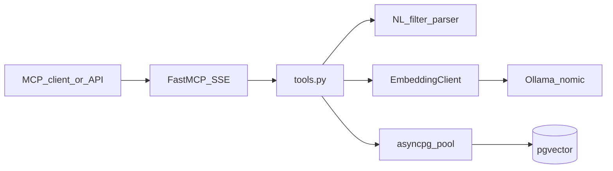

# Part 3 — Python MCP Server (FastMCP)

Build the server in [mcp-server/](../../mcp-server/) against the Part 2 contracts in [reports/section-2.md](../../reports/section-2.md) and [database/queries/hybrid_search.sql](../../database/queries/hybrid_search.sql). Tool signatures stay exactly as specified in the brief. End-to-end relevance for the five 3.3 queries still needs 1.4/1.5 embeddings; this part returns empty lists on an empty table and is proven with seeded fake 768-dim vectors.

## Contracts to honour

- Query text is prefixed with `search_query:` before Ollama `POST /api/embed` (768-dim `nomic-embed-text`). Stored docs will use `search_document:` in 1.4.
- Hybrid search is the documented SQL: cosine `<=>`, similarity `1 - distance`, optional filters `$2` genre / `$3` decade / `$4` min IMDB / `$5` MPAA, `LIMIT $6`.
- `get_movie_by_title` uses the V2 GIN trigram index (`title % $1` / `similarity()`).
- Register an asyncpg `vector` codec (`pgvector` Python package).

## SQL tweak (bind params unchanged)

[database/queries/hybrid_search.sql](../../database/queries/hybrid_search.sql) currently SELECTs `id, title, major_genre, decade, imdb_rating, similarity`. Expand the SELECT to cover [MovieResult](../../mcp-server/src/server/models.py): add `release_year`, `mpaa_rating`, `director`, `distributor`, `rt_rating`. Keep `$1`–`$6`. Update [pipeline/tests/test_hybrid_search_query.py](../../pipeline/tests/test_hybrid_search_query.py).

Copy the file into `mcp-server/src/server/sql/` (image build context is `./mcp-server`). A test asserts the copy matches the database original.

Additional queries live next to it (not Flyway): exact-then-fuzzy title, similar-movies kNN excluding self, distinct genres, dataset stats.

## NL filter extraction (in MCP)

When `genre_filter` / `decade` / `min_imdb_rating` / `mpaa_rating` are `None`, parse them from `query`. Explicit args always win.

Lightweight rules (no LLM):

- Genre synonyms → Vega `major_genre` (`action` → `Action`, `sci-fi` → `Science Fiction`, `thriller` → `Thriller/Suspense`, …)
- `90s` / `1990s` → `decade=1990`
- `high IMDB` / `highly rated` → `min_imdb_rating=7.5` (same threshold as the Part 2 example)
- `PG-13`, `R-rated`, … → `mpaa_rating`

Director / Disney / small budget / low RT are **not** SQL filters (not in the tool signature). They ride on the embedding because they appear in the 1.3 `augmented_text` template.

## Implementation

**Pool and queries** — fill [mcp-server/src/server/db.py](../../mcp-server/src/server/db.py): `init_pool` / `get_pool` / `close_pool` with `pool_min_size` / `pool_max_size` from [mcp-server/src/config.py](../../mcp-server/src/config.py); `register_vector` on connect; helpers that run the SQL above. UUID → `str` for `MovieResult.id`; null `title` → `""`. Invalid UUID or missing movie for `get_similar_movies` → `[]`.

**Embedding client** — new thin `httpx` wrapper in `mcp-server/src/server/embeddings.py` (do not share the pipeline package; separate images). Single-text embed, assert `len == EMBEDDING_DIM`. Duplicate is fine until 1.4; extract a shared client only if that stage wants it.

**Tools** — implement the five functions in [mcp-server/src/server/tools.py](../../mcp-server/src/server/tools.py):

- `search_movies_by_description`: parse filters → embed → hybrid SQL. Clamp `top_k` to 1–50.
- `get_movie_by_title`: exact `lower(title)` then trigram; `None` if no match.
- `get_similar_movies`: vector kNN excluding `movie_id`.
- `list_genres`: distinct non-null `major_genre`, sorted.
- `get_dataset_stats`: count, distinct genres, min/max `release_year`, avg `imdb_rating`.

Empty corpus → empty list / `None`, not an error.

**Process** — [mcp-server/src/server/main.py](../../mcp-server/src/server/main.py):

- Lifespan: open/close pool
- `@mcp.custom_route("/health")`: 200 after `SELECT 1`, else 503 (Compose already curls this)
- `structlog` JSON (`event`, `tool`, `duration_ms`, `trace_id`); bind W3C `traceparent` if present
- `mcp.run(transport=settings.transport, host=..., port=...)` — default `sse`, overridable via `MCP_TRANSPORT`

**Image** — [mcp-server/Dockerfile](../../mcp-server/Dockerfile): `apt-get install -y curl` so the Compose healthcheck works. Add `pgvector` to [mcp-server/pyproject.toml](../../mcp-server/pyproject.toml).

## Tests and docs

Replace [mcp-server/tests/test_placeholder.py](../../mcp-server/tests/test_placeholder.py):

- NL parser cases for all five 3.3 queries (what is extracted vs left to the embedding)
- Hybrid SQL copy stays in sync
- Tools against a mocked pool + embedding client
- `/health` 200 vs 503

No testcontainers required for the CI bar. Optional later: Postgres fixture with three seeded rows.

Docs: living report [reports/section-3.md](../../reports/section-3.md) (same style as sections 1–2); un-ignore it in `.gitignore`; fill README §8 (tools, SSE URL, how to hit `/health`).

## Out of scope

Pipeline 1.2–1.5, .NET MCP client, extra SQL filters (budget/director/RT), changing tool signatures, Alembic/seed scripts.

## Suggested order

1. Widen hybrid SQL + contract test; add the other SQL files
2. `db.py` pool + vector codec + helpers
3. Embedding client
4. NL parser + tests
5. Wire the five tools
6. Lifespan, `/health`, JSON logging, Dockerfile `curl`
7. `reports/section-3.md` + README §8
8. `pytest` in `mcp-server/`
