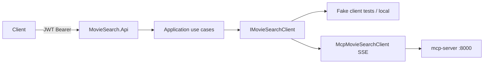

# Part 4 — .NET 10 Web API (parallel with Part 3)

Part 4 is a JWT-protected BFF over MCP. It does **not** talk to Postgres. While Part 3 is in flight we freeze the tool/DTO contract, implement everything against `IMovieSearchClient`, and ship a **fake client** so endpoints, auth, observability, and tests do not wait on a live MCP server. **Do not edit `mcp-server/`.**

## Locked decisions

- **Minimal APIs** (not controllers): seven routes, first-class OpenAPI in .NET 10, less ceremony. Justify this in README §9.
- **Get-by-id**: Part 3 adds `get_movie_by_id(movie_id: str) -> MovieResult | None`. Until it exists, the fake client implements it; the real MCP adapter lands last.
- **RBAC (strict)**: `reader` → only `GET /api/v1/movies/search`. `admin` → all other `/api/v1/*` plus search. `/health`, `/metrics`, `/openapi`, `/swagger`, `/auth/token` stay anonymous.
- **Auth**: `POST /auth/token` client-credentials. Two env clients (`AUTH_READER_*`, `AUTH_ADMIN_*`). JWT role claim `reader` | `admin`.

## Frozen MCP contract (do not wait to code against this)

Mirror [mcp-server/src/server/models.py](../../mcp-server/src/server/models.py) as Domain records (`Movie`, `DatasetStats`) with the same JSON names.

| API route | MCP tool | Auth |
|---|---|---|
| `GET /api/v1/movies/search` | `search_movies_by_description` (`q`→`query`, `genre`→`genre_filter`, `top_k` max 50) | reader, admin |
| `GET /api/v1/movies/{id}` | **`get_movie_by_id`** (new; ask Part 3) | admin |
| `GET /api/v1/movies/{id}/similar` | `get_similar_movies` | admin |
| `GET /api/v1/movies/genres` | `list_genres` | admin |
| `GET /api/v1/stats` | `get_dataset_stats` | admin |
| `GET /health` | local probes (readiness includes MCP ping when client is real) | anonymous |
| `POST /auth/token` | local | anonymous |

Document the extra tool in [reports/section-4.md](../../reports/section-4.md) so the Part 3 thread can pick it up. `MovieResult.id` is already a string; `get_similar_movies` already takes `movie_id`, so lookup-by-id is implied on their side.

## Layering (fill the empty scaffold)

Existing tree is correct but empty except `/health` in [api/src/MovieSearch.Api/Program.cs](../../api/src/MovieSearch.Api/Program.cs). [api/MovieSearch.sln](../../api/MovieSearch.sln) is a comment stub — regenerate a real solution before the [api/Dockerfile](../../api/Dockerfile) `dotnet restore` will work. Install `curl` in the runtime image so the Compose healthcheck (`curl -f http://localhost:8080/health`) actually works.

- **Domain**: `Movie`, `DatasetStats`, `SearchQuery`, `IMovieSearchClient` (the only outbound port).
- **Application**: one use-case service per route (`SearchMovies`, `GetMovieById`, `GetSimilarMovies`, `ListGenres`, `GetDatasetStats`) plus cache-aside wrapping the port (TTL from `CACHE_TTL_SECONDS`).
- **Infrastructure**: `FakeMovieSearchClient` (deterministic fixtures) and `McpMovieSearchClient` using official `ModelContextProtocol` + `HttpClientTransport` with `TransportMode.Sse` against `MCP_SERVER_URL` (typically `http://mcp-server:8000/sse`). Select via `MCP_CLIENT=fake|mcp` (default `mcp` in Compose, `fake` in tests).
- **Api**: endpoint mapping, JWT, rate limit, timeouts, Serilog, OpenTelemetry, OpenAPI.

Keep Infrastructure → Application → Domain. Api wires DI only.

## Cross-cutting (Part 4.2 / 4.4 / 4.5 / 4.6)

- **JWT**: `Microsoft.AspNetCore.Authentication.JwtBearer`; issuer/audience/key from existing [.env.example](../../.env.example) (`JWT_*`). Add reader/admin client id/secret vars. `[Authorize(Roles = "reader,admin")]` on search; `[Authorize(Roles = "admin")]` on the rest of `/api/v1`.
- **Rate limit**: built-in `AddRateLimiter`, partitioned by JWT `sub`, **60/min** (`RATE_LIMIT_PER_MINUTE`), 429 problem+json.
- **Timeout**: request-timeout middleware, default **30s** (`REQUEST_TIMEOUT_SECONDS`). MCP `HttpClient` uses the same budget.
- **Cache**: `IMemoryCache` around MCP calls, key = tool + normalized args (not HTTP response cache — `Authorization` would bust it).
- **Serilog**: JSON console + rolling file under `/app/logs`.
- **OpenTelemetry**: ASP.NET + HttpClient instrumentation; OTLP traces to `OTEL_EXPORTER_OTLP_ENDPOINT` (`http://jaeger:4317`); Prometheus scrape at `/metrics` (already in [monitoring/prometheus.yml](../../monitoring/prometheus.yml)). Tag MCP tool name/latency as a histogram so Grafana can chart “MCP tool call latency”. Propagate W3C `traceparent` on the MCP HttpClient.
- **OpenAPI 3.1**: `AddOpenApi` / `MapOpenApi` at `/openapi/v1.json`; Swagger UI at `/swagger`; examples on all params/responses; generate/copy **[openapi.json](../../openapi.json)** at repo root.
- **Health**: `{ status, checks: { mcp } }`. Liveness stays 200; readiness 503 when real MCP is configured and down.

## Tests and load (can run without Part 3)

[api/tests/MovieSearch.Tests](../../api/tests/MovieSearch.Tests) + `WebApplicationFactory` with `MCP_CLIENT=fake`:

- Search query validation (`q` required, `top_k` clamped 1–50)
- 401 without token; 403 when `reader` hits `/stats`, `/{id}`, `/similar`, `/genres`
- 200 search as reader; token issuance for both roles
- Cache: second identical search does not call the fake twice
- Rate limit: 61st request → 429
- 404 from `get_movie_by_id`

Wire [.github/workflows/ci.yml](../../.github/workflows/ci.yml) `dotnet-lint-test`: setup .NET 10, `dotnet format --verify-no-changes`, `dotnet test`.

Replace [scripts/load_test.js](../../scripts/load_test.js) (fix the broken `k6/check` import): obtain admin or reader token, ramp VUs against `/api/v1/movies/search?q=...`, threshold `http_req_duration p(95)<500`. This is the only step that **needs live MCP + data**; keep it documented as a full-stack check.

Fill [monitoring/grafana/dashboards/movie-search.json](../../monitoring/grafana/dashboards/movie-search.json): request rate, latency p50/p95/p99, error rate, MCP tool latency, active connections.

## Parallelism with Part 3

- Implement and unit-test the full API against the fake client immediately.
- Land `McpMovieSearchClient` behind the same interface; if SSE handshake fails until Part 3 is healthy, tests still pass.
- Compose already has `api.depends_on: mcp-server (healthy)` in [docker-compose.yml](../../docker-compose.yml) — leave it. For API-only iteration: `MCP_CLIENT=fake` and `docker compose run --no-deps api` (or disable the MCP check when fake).
- When Part 3 adds `get_movie_by_id` and SSE `/health`, flip default client to `mcp` and add one optional integration test gated on the server.

## README (sections the brief grades)

Update [README.md](../../README.md) §§9–11 and 13: curl examples (token + search + admin-only 403), how to get tokens, where Jaeger/Prometheus/Grafana/logs live, how to run `dotnet test` and `k6 run scripts/load_test.js`. Keep a living [reports/section-4.md](../../reports/section-4.md) like section 1.

## Suggested build order

1. Real `.sln`, NuGet packages, Dockerfile `curl`, `appsettings.json`
2. Domain models + `IMovieSearchClient` + fake
3. Application use cases + memory cache
4. Minimal API routes + JWT + strict RBAC + `/auth/token`
5. OpenAPI/Swagger + root `openapi.json`
6. Rate limiting, timeouts, ProblemDetails
7. Serilog + OTel traces/metrics + Grafana panels
8. xUnit/WebApplicationFactory tests + CI job
9. `McpMovieSearchClient` (SSE) + health readiness
10. k6 script + README/report
