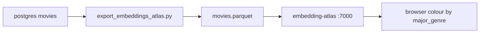

# Part 5 — Embedding Atlas

Bonus visualization of the **same** `movies` rows Part 2 defined. No schema changes. No separate seed — the pipeline (1.5) remains the only writer; Atlas is a reader.

## Brief vs current gap

The PDF requires:

- Export embeddings + metadata from pgvector in an Atlas-compatible format
- [`scripts/export_embeddings_atlas.py`](../../scripts/export_embeddings_atlas.py) (stub: `NotImplementedError`)
- Viewer at `http://localhost:7000` via Compose
- Colour points by Major Genre
- README section on how to interpret the view

Compose already declares `atlas` (`build: ./scripts/atlas`, port 7000, waits on `postgres` healthy + `migrate` completed), but **`scripts/atlas/` does not exist**, so `docker compose up` cannot build it. Embeddings are still nullable until 1.5 ([`reports/section-2.md`](../../reports/section-2.md)); Atlas must tolerate that.

## Data contract (from Part 2)

Read only rows with a real vector, using columns V1 already has for Atlas / hybrid search:

- Identity / hover: `id`, `title`, `augmented_text`
- Colour / filters: `major_genre` (the colour field), `decade`, `mpaa_rating`, `director`, `distributor`, `imdb_rating`, `rt_rating`, `budget_tier`, `blockbuster_flag`
- Vectors: `embedding vector(768)` (nomic / Ollama), cosine space — same as HNSW `vector_cosine_ops`

Omit `us_dvd_sales` (not in the table). Untitled 2006 row is included only if 1.5 wrote an embedding for it.



## Export format

Apple Embedding Atlas accepts Parquet. Store:

- Metadata as scalars
- `embedding` as a `list<float>` of length 768 (not pgvector text). Atlas CLI: `--vector embedding`
- `title` as `--text` so hover / search show movie names

Do **not** precompute UMAP in the export script. ~3,200 points; Atlas will project at startup with `--umap-metric cosine --umap-random-state 42` (matches the HNSW cosine index; seed keeps the map stable across restarts). Keeps the export a thin pgvector dump; the heavy `embedding-atlas` deps stay in the Atlas image.

SQL shape (document in [`database/queries/`](../../database/queries/) the same way [`hybrid_search.sql`](../../database/queries/hybrid_search.sql) is documented — **not** a Flyway migration):

```sql
SELECT id, title, major_genre, decade, mpaa_rating, director, distributor,
       imdb_rating, rt_rating, budget_tier, blockbuster_flag, augmented_text,
       embedding
FROM movies
WHERE embedding IS NOT NULL;
```

Parse `embedding` via an asyncpg `vector` codec (or `embedding::text` → float list) and assert `len == 768`.

## Atlas container + Compose

Add the missing image at `scripts/atlas/Dockerfile` (Python 3.12, pin `embedding-atlas`, copy the export script). Entrypoint:

1. Poll Postgres until `COUNT(*) FILTER (WHERE embedding IS NOT NULL) > 0` (sleep/retry; log clearly). This is how Compose `up` works **before** 1.5 exists and **after** it lands, without a fake seed.
2. Run `export_embeddings_atlas.py` → `/data/movies.parquet`
3. `exec embedding-atlas /data/movies.parquet --vector embedding --text title --host 0.0.0.0 --port 7000 --umap-metric cosine --umap-random-state 42`

Wire in [`docker-compose.yml`](../../docker-compose.yml):

- Keep a **single** `atlas` service (brief’s service table)
- `depends_on`: `postgres` healthy + `migrate` completed (already matches section 2)
- Healthcheck: HTTP `:7000`
- Bind `0.0.0.0:7000` (CLI default host is `localhost`, which would be unreachable from the host)

Do **not** `depends_on: pipeline` yet: today the pipeline exits after 1.1 without writing vectors, so that edge would start Atlas on an empty table. After 1.5, the wait loop is enough; optionally add `pipeline: service_completed_successfully` then.

## Colour by Major Genre

Atlas has **no** `--color` / `--category` CLI flag; default colour-on-load via `initialState` is fragile ([apple/embedding-atlas#88](https://github.com/apple/embedding-atlas/issues/88)). Plan:

- Always export `major_genre` as a first-class column
- README + `reports/section-5.md`: open Atlas → Color by Field → `major_genre`
- What to look for: genre clusters (Action vs Drama), mixed regions (genre-ambiguous plots), outliers (title that embeds with the wrong neighbourhood)

That satisfies “color-code points by Major Genre” without a brittle static export.

## Docs (same living-report pattern as 1 and 2)

- New [`reports/section-5.md`](../../reports/section-5.md): what we export, why Parquet + `--vector`, wait-for-1.5, colour instructions, how to re-run
- Un-ignore it in [`.gitignore`](../../.gitignore) (`!reports/section-5.md`)
- Fill README visualization notes (brief item: interpret the view) and keep the endpoints row `http://localhost:7000`

## Tests (no live Postgres, same style as [`pipeline/tests/test_hybrid_search_query.py`](../../pipeline/tests/test_hybrid_search_query.py))

- Export SQL selects `embedding` + `major_genre` and filters `WHERE embedding IS NOT NULL`
- Fixture DataFrame → Parquet: `embedding` is a 768-float list; `major_genre` present
- Compose / Dockerfile mention port 7000, `--vector embedding`, `--host 0.0.0.0`

## Out of scope

- 1.2–1.5 (impute / augment / embed / load) — Atlas waits until those write vectors
- Schema / index changes
- Terraform / ECS for Atlas (bonus is local Compose; cloud is Part 6)
