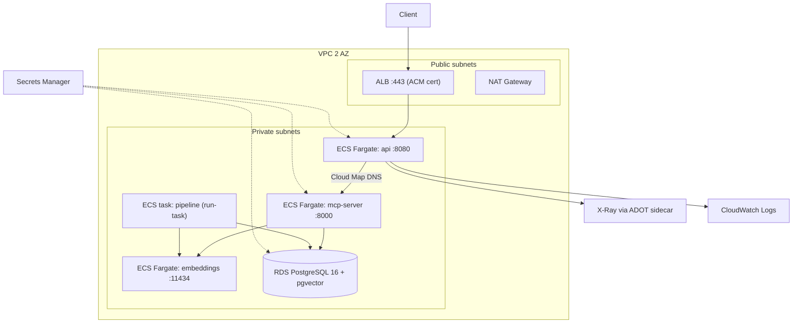

# Part 6 — Infrastructure & DevOps

## Where things stand

Parts 1–5 have landed reports in [reports/](../../reports/); Part 6 is the last graded section and is worth 20% of the score. The audit:

- **6.1 Docker Compose** — mostly done in [docker-compose.yml](../../docker-compose.yml). All nine required services exist. Gaps: `prometheus`, `grafana`, `jaeger` have no healthcheck; `grafana` uses the short `depends_on: - prometheus` form instead of `condition: service_healthy`; `api` does not depend on `jaeger`; five images are pinned to `:latest`.
- **6.2 Terraform** — effectively not started. All eight modules are 2-line `# TODO: implement.` stubs, `terraform/outputs.tf` is a single comment, and both environment roots are comments. The backend block in [terraform/main.tf](../../terraform/main.tf) is commented out.
- **6.3 CI/CD** — [.github/workflows/ci.yml](../../.github/workflows/ci.yml) has a working `dotnet-lint-test` job; the Python, Docker and Terraform jobs are `TODO` comments with only a checkout step. [.github/workflows/cd.yml](../../.github/workflows/cd.yml) is entirely TODO.

Decisions taken: hand-rolled resources in every module (no registry modules), and real AWS credentials are available, so the backend, `terraform plan`, and CD will target a live account.

## Blocker to be aware of

Pipeline stages 1.2–1.5 still `raise NotImplementedError` (`pipeline/src/pipeline/{imputation,augmentation,embedding,loader}.py`). This means a plain `docker compose up --build` currently starts a `pipeline` service that crashes, and the CI compose integration test cannot assert on search results. I will put `pipeline` behind a Compose profile so `up --build` is clean today, and scope the CI smoke test to service health plus an authenticated `/api/v1/movies/search` returning HTTP 200 (empty results are acceptable). Removing the profile is a one-line change when 1.5 lands.

## Target AWS topology

## 6.1 Compose hardening

Edits to [docker-compose.yml](../../docker-compose.yml):

- Add healthchecks to `prometheus` (`/-/healthy`), `grafana` (`/api/health`), `jaeger` (admin port `14269`). Verify at implementation time which of `wget`/`curl` each image ships; the Jaeger all-in-one image is the one likely to need a fallback (a `CMD-SHELL` TCP check).
- Convert `grafana`'s `depends_on` to the long form with `condition: service_healthy`, and add `jaeger: service_healthy` to `api` (it exports OTLP there).
- Pin all `:latest` images to explicit tags (`prom/prometheus`, `grafana/grafana`, `jaegertracing/all-in-one`, `ollama/ollama`) so a clean machine reproduces the same stack.
- Move `pipeline` to `profiles: [pipeline]` with a comment pointing at the 1.5 follow-up, keeping `docker compose run --rm pipeline` working.
- Add a named network and `restart: unless-stopped` on the long-lived services.

## 6.2 Terraform — hand-rolled ECS Fargate

**Restructure the roots first.** Today [terraform/main.tf](../../terraform/main.tf) holds the provider, which conflicts with per-environment backends. Turn `terraform/` into a composition module (modules wired together, variables in, outputs out, no `provider`/`backend`), and make `terraform/environments/{dev,prod}/` the actual roots, each declaring its own `backend "s3"`, provider, and one `module "platform" { source = "../.." }` block plus a `terraform.tfvars`.

Add `terraform/bootstrap/` (a tiny separate root with local state) to create the S3 state bucket, versioning/encryption, and the DynamoDB lock table.

Then implement each module:

- **networking** — VPC, public + private subnets across 2 AZs, IGW, NAT gateway (single in dev, per-AZ in prod), route tables, security groups (`alb-sg` → `ecs-sg` → `rds-sg`, each referencing the previous), VPC Flow Logs to a CloudWatch log group, and interface endpoints for ECR/logs/Secrets Manager plus an S3 gateway endpoint to cut NAT egress.
- **ecr** — one repository per built image (`api`, `mcp-server`, `pipeline`), scan-on-push, immutable tags, lifecycle policy retaining the last N images.
- **secrets** — Secrets Manager entries for the DB password (`random_password`), `JWT_SIGNING_KEY`, and the reader/admin client secrets. No plaintext credentials anywhere; task definitions consume these through the `secrets` block, not `environment`.
- **rds** — PostgreSQL 16 in a private-subnet DB subnet group, `publicly_accessible = false`, storage encrypted, automated backups, parameter group, and Multi-AZ in prod only. pgvector is enabled via `CREATE EXTENSION vector` — I will add it as a Flyway migration (`V0__extension.sql`) so RDS and local Postgres take the same path.
- **iam** — ECS task *execution* role (ECR pull, CloudWatch Logs, Secrets Manager read scoped to our secret ARNs), a separate task role per service, an X-Ray write policy, the application-autoscaling role, and the GitHub OIDC provider + deploy role that `cd.yml` assumes. No IAM users, no access keys.
- **alb** — internet-facing ALB in the public subnets, HTTP listener redirecting to HTTPS, HTTPS listener with an ACM certificate (DNS-validated against a `domain_name` variable, or a passed-in `certificate_arn`), target group for `api:8080` health-checked on `/health`, and access logs to S3.
- **compute** — ECS cluster with Container Insights; Fargate task definitions and services for `api`, `mcp-server`, and `embeddings`; AWS Cloud Map private DNS namespace so `api` resolves `mcp-server` the same way it does in Compose (`MCP_SERVER_URL`); the `pipeline` as a task definition intended for `run-task`; target-tracking autoscaling on both CPU and memory as the brief requires; an ADOT sidecar on `api` for X-Ray. Note `embeddings` (Ollama) needs a generous CPU/memory allocation — I will size it explicitly and call that out.
- **monitoring** — CloudWatch log groups with retention, a dashboard, alarms (ALB 5xx, target p95 latency, ECS CPU/memory, RDS storage), and an X-Ray sampling rule.

Tagging (`Environment`, `Project`, `ManagedBy`) is already handled by `default_tags` in the provider; I will keep that and move it into the environment roots.

## 6.3 CI/CD

[ci.yml](../../.github/workflows/ci.yml) — fill in the three stub jobs:

- `python-lint-test`: `astral-sh/setup-uv`, `uv sync`, then `ruff check`, `mypy`, and `pytest` across `pipeline/` and `mcp-server/` (the workspace is already configured in [pyproject.toml](../../pyproject.toml)).
- `docker-build-integration`: buildx with GHA layer cache, `docker compose build`, `docker compose up -d` from `.env.example`, wait on healthchecks, then a smoke script that mints a token from `/auth/token` and asserts 200 on search and 403 on an admin route as a reader.
- `terraform-validate`: `fmt -check -recursive`, `init -backend=false`, `validate` on every module, and a `plan` for `environments/dev` gated on OIDC credentials being present.

[cd.yml](../../.github/workflows/cd.yml) — reuse CI via `workflow_call`, then assume the OIDC deploy role, build and push the three images to ECR tagged with the git SHA, `terraform apply` dev, run smoke tests against the dev ALB, and `terraform apply` prod behind the existing `environment: prod` approval gate.

## Documentation

- New `reports/section-6.md` following the format of [reports/section-5.md](../../reports/section-5.md): ECS-vs-EKS justification, module-by-module decisions, cost notes, and what is deliberately not deployed (Prometheus/Grafana/Jaeger and Atlas stay local; AWS uses CloudWatch + X-Ray).
- Rewrite [terraform/README.md](../../terraform/README.md) with the real usage flow and tick off its requirements checklist.
- Fill README section 12 (Terraform Deployment) and refresh sections 2, 4 and 14 in [README.md](../../README.md) for the Compose changes.

## Verification

`terraform fmt`/`validate` on all modules, `terraform plan` against dev with the real account, `docker compose config` plus a full `up --build` health pass locally, and `act` or a draft PR to exercise the workflows. Because dev is real infrastructure, I will document `terraform destroy` and keep dev sized down (single NAT, `db.t4g.micro`, minimal task counts).